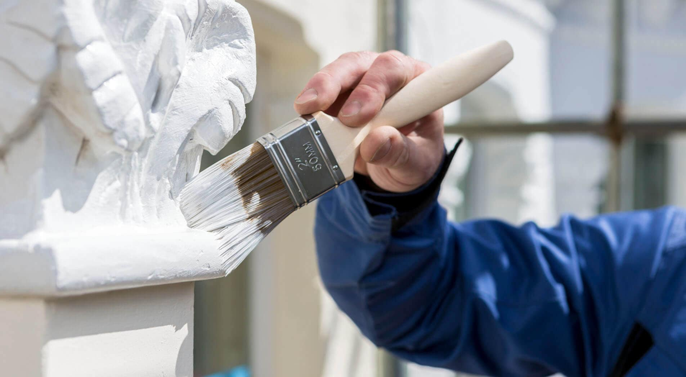
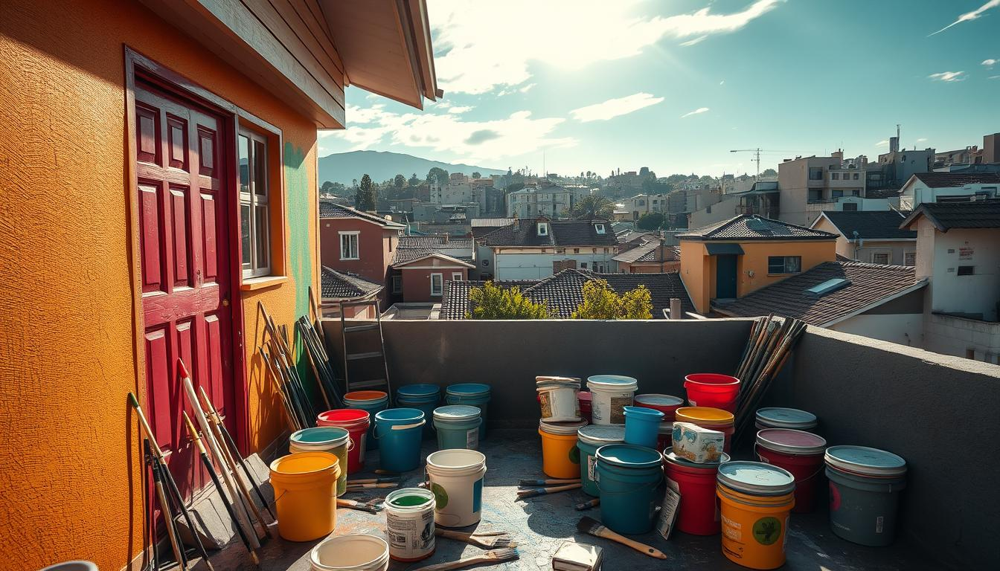
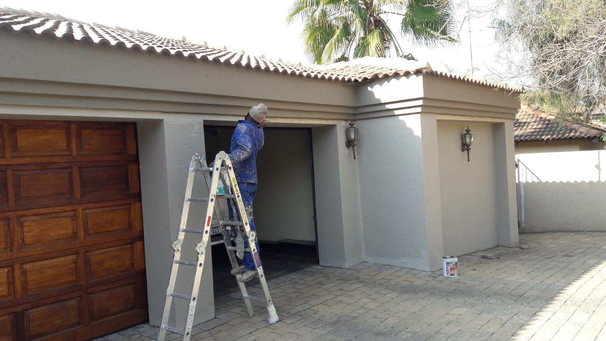

# Portfolio Explanation: ProPaint Site Components

This document provides a comprehensive explanation of all components, sections, and elements in the ProPaint website portfolio, detailing what each part does and how it appears on the website.

## Overall Site Structure

The website is a static HTML/CSS/JavaScript site for Jostas Painting Services, consisting of:
- **index.html**: Homepage with hero section, services overview, about section, and portfolio
- **about.html**: About page with company information, mission, team photos, and portfolio thumbnails
- **services.html**: Services page with detailed service offerings and contact form
- **assets/css/styles.css**: Custom styles defining the visual appearance
- **assets/images/**: Image assets for the site

## Detailed Component Explanations

### 1. Navigation Bar (Appears on all pages)

**HTML Structure:**
```html
<nav class="navbar navbar-expand-lg bg-light p-4 px-5">
    <div class="container-fluid px-0">
        <a class="navbar-brand text-dark jostas-logo" href="#">
            Jostas <span>Painting Services</span>
        </a>
        <!-- Navigation links -->
    </div>
</nav>
```

**CSS Classes:**
- `.jostas-logo`: Styles the company name with larger main text (24px) and smaller subtitle (14px)
- Appears as a horizontal bar at the top with light background

**Function:** Provides site navigation and branding. The logo appears as "Jostas" with "Painting Services" below it.

### 2. Hero Section (index.html only)

**HTML Structure:**
```html
<section class="hero-section d-flex align-items-center">
    <div class="container-fluid px-0 hero-content">
        <div class="row w-100 mx-0">
            <div class="col-lg-6 d-flex align-items-center hero-text-wrapper min-vh-100 py-5">
                <div>
                    <h1>Adding color to your world</h1>
                    <a href="services.html#contact" class="btn btn-primary cta-button-custom rounded-1">Get a Free Quote</a>
                </div>
            </div>
        </div>
    </div>
    <div class="hero-image-container d-none d-lg-block">
        
    </div>
</section>
```

**CSS Classes:**
- `.hero-section`: Creates the large banner with burnt orange background (#b97652), minimum 550px height
- `.hero-content`: Adds 50px left padding for text alignment
- `.hero-image-container`: Positions image on the right half, with 90% opacity overlay
- `.hero-text-wrapper`: Ensures text appears above the image (z-index: 2)
- `.cta-button-custom`: Styles the call-to-action button with brown background and white text

**Appearance:** Large orange banner covering top of homepage with white text on left ("Adding color to your world") and painter image on right. Includes a brown "Get a Free Quote" button.

### 3. Services Cards Section (index.html only)

**HTML Structure:**
```html
<section class="container-fluid services-cards-section position-relative" style="margin-top: -100px; z-index: 10;">
    <div class="row justify-content-center g-4 px-5">
        <div class="col-lg-3 col-md-6">
            <div class="card service-card p-4 rounded-3 shadow-sm bg-white text-center">
                <div class="card-icon mb-3"><i class="fas fa-home"></i></div>
                <h5 class="card-title text-uppercase fw-bold text-dark">Residential</h5>
            </div>
        </div>
        <!-- Similar cards for Commercial, Interior, Exterior -->
    </div>
</section>
```

**CSS Classes:**
- `.services-cards-section`: Centers content with max-width 1400px, positioned above hero section
- `.service-card`: White rounded cards (150px min height) that lift 5px on hover
- `.card-icon`: Circular brown background (40px) behind FontAwesome icons
- `.card-title`: Uppercase bold text with 0.5px letter spacing

**Appearance:** Four white cards overlapping the hero section, each with a brown circular icon and uppercase service name (Residential, Commercial, Interior, Exterior).

### 4. About Section (index.html)

**HTML Structure:**
```html
<section class="container-fluid py-5 mt-5">
    <div class="row px-5 justify-content-center">
        <div class="col-lg-6 mb-5">
            <h2 class="display-6 fw-bold text-dark mb-4">About Jostas</h2>
            <p class="text-secondary mb-4">Company description...</p>
            <a href="#about" class="text-decoration-none fw-bold">Learn More</a>
        </div>
        <div class="col-lg-5 offset-lg-1 d-flex align-items-start">
            <div class="about-image-block w-100">
                <div style="background-color: #e0b08e; height: 600px; margin-top: 150px;">
                    
                </div>
            </div>
        </div>
    </div>
</section>
```

**CSS Classes:**
- `.display-6`: Large section headings (2.5rem font size)
- `.text-secondary`: Medium gray text color (#777)
- `.portfolio-image-container`: Ensures images fit containers with object-fit: cover

**Appearance:** Two-column layout with "About Jostas" heading and description on left, large portfolio image on right with orange background tint.

### 5. Portfolio Section (index.html)

**HTML Structure:**
```html
<div class="row g-4">
    <div class="col-12 mb-4">
        <div class="portfolio-image-container" style="height: 400px; background-color: #e8d0bd;">
            
        </div>
    </div>
    <!-- Grid of smaller images -->
</div>
```

**Appearance:** Large hero portfolio image (400px height) followed by a 2x2 grid of smaller images (250px height each), all with beige background tints.

### 6. About Page Content (about.html)

**HTML Structure:**
```html
<div class="container-fluid py-5 page-content-container">
    <div class="row justify-content-center">
        <div class="col-lg-8 col-xl-6 px-5">
            <h5 class="text-uppercase mb-4">Making color simple</h5>
            <h1 class="display-3 fw-bold text-dark mb-5">About us</h1>
            <p class="mb-5 text-secondary">Company description...</p>
            <h2 class="display-6 fw-bold text-dark mb-4">Our mission</h2>
            <h3 class="fw-normal text-secondary">Adding color to your world</h3>
        </div>
    </div>
</div>
```

**CSS Classes:**
- `.page-content-container`: Sets off-white background for content areas
- `.display-3`: Very large page titles (3.5rem)
- `.fw-normal`: Overrides font-weight to 400 for mission statement

**Appearance:** Centered content with large "About us" heading, company description, and mission statement in lighter styling.

### 7. Team Photos Section (about.html)

**HTML Structure:**
```html
<div class="row g-4 mb-5">
    <div class="col-md-6">
        <div class="team-photo-container rounded-3 overflow-hidden" style="height: 350px; background-color: #d8c2b0;">
            
        </div>
    </div>
    <!-- Second team photo -->
</div>
```

**Appearance:** Two side-by-side team photos (350px height) with rounded corners and beige background tints.

### 8. Portfolio Thumbnails (about.html)

**HTML Structure:**
```html
<div class="row g-3">
    <div class="col-6 col-md-3">
        <div class="portfolio-thumb-container rounded-3 overflow-hidden" style="height: 150px; background-color: #f7e9d7;">
            
        </div>
    </div>
    <!-- Three more thumbnails -->
</div>
```

**Appearance:** 2x2 grid of small portfolio thumbnails (150px height) with various background tints.

### 9. Services Page Content (services.html)

**HTML Structure:**
```html
<div class="container-fluid py-5 page-content-container">
    <div class="row justify-content-center">
        <div class="col-lg-8 col-xl-6 px-5">
            <h1 class="display-3 fw-bold text-dark mb-5">Our Services</h1>
            <div class="row g-4 mb-5">
                <div class="col-6 col-md-4">
                    <div class="service-block text-center p-3 rounded-3">
                        <div class="icon-placeholder mb-2"><i class="fas fa-home"></i></div>
                        <h6 class="fw-bold text-uppercase mb-1">Residential</h6>
                        <small class="text-secondary d-block">Description...</small>
                    </div>
                </div>
                <!-- Five more service blocks -->
            </div>
        </div>
    </div>
</div>
```

**CSS Classes:**
- `.service-block`: Light beige background blocks that gain subtle shadow on hover
- `.icon-placeholder`: Brown border containers (30px) for service icons

**Appearance:** Large "Our Services" heading followed by 2x3 grid of service blocks, each with an icon, title, and description in rounded light backgrounds.

### 10. Contact Form (services.html)

**HTML Structure:**
```html
<form>
    <div class="form-group mb-3">
        <select class="form-select border-0 bg-white shadow-sm">
            <option>Service</option>
            <!-- Service options -->
        </select>
    </div>
    <div class="form-group mb-3">
        <textarea class="form-control border-0 bg-white shadow-sm" placeholder="Please provide more details..."></textarea>
    </div>
    <!-- Contact fields: Name, Email, Phone -->
    <div class="d-flex justify-content-between align-items-center">
        <div class="social-links d-flex gap-3">
            <a href="#" class="social-btn"><i class="fab fa-whatsapp"></i></a>
            <!-- Facebook, Instagram links -->
        </div>
        <button type="submit" class="btn cta-button-custom rounded-1">Send</button>
    </div>
</form>
```

**CSS Classes:**
- `.form-control`, `.form-select`: Rounded input styling (5px border-radius)
- `.social-links`: Flex container centering social icons
- `.social-btn`: Circular black buttons (45px) that invert colors on hover

**Appearance:** Service dropdown, message textarea, name/email/phone inputs, and submit button with social media icons (WhatsApp, Facebook, Instagram) on the left.

## Global Styles and Variables

**CSS Variables (:root):**
- `--bs-dark: #333333`: Primary text color (dark gray)
- `--bs-light: #fdfaf7`: Background color (off-white)
- `--color-hero-bg: #b97652`: Hero section background (burnt orange)
- `--color-cta: #8a4e32`: Accent color for buttons and icons (dark brown)

**Body Styles:**
- Font family: Poppins (Google Fonts)
- Global background: Light variable
- Default text color: Dark variable

## Responsive Behavior

- Hero image hides on small screens (d-none d-lg-block)
- Service cards stack on mobile (col-md-6, col-lg-3)
- Content containers use responsive padding and widths
- Navigation collapses to hamburger menu on mobile

## Image Assets

All images are stored in `assets/images/` and include:
- Hero images (Image9.png, Image2.png)
- Portfolio images (Image1.png, Image3.png, Image5.png)
- Team photos (Image10.jpg, Image11.jpg)
- Thumbnail images (Image4.png, Image6.png, Image7.png, Image8.png)

Images use `object-fit: cover` to maintain aspect ratios within their containers.

## JavaScript Dependencies

- **Bootstrap 5.3.3**: Provides responsive grid, navigation, and component styling
- **Font Awesome 6.5.0**: Supplies icons for services and social media
- **Google Fonts (Poppins)**: Custom typography

This comprehensive structure creates a professional, responsive painting services website with clear visual hierarchy and user-friendly navigation.